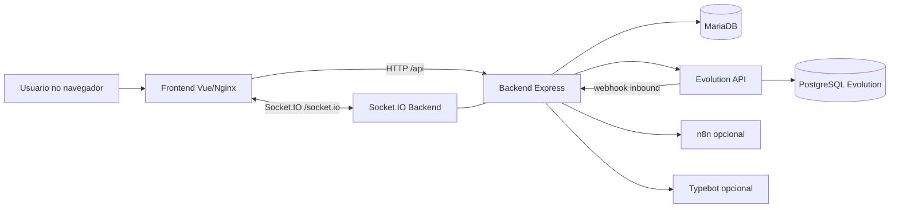
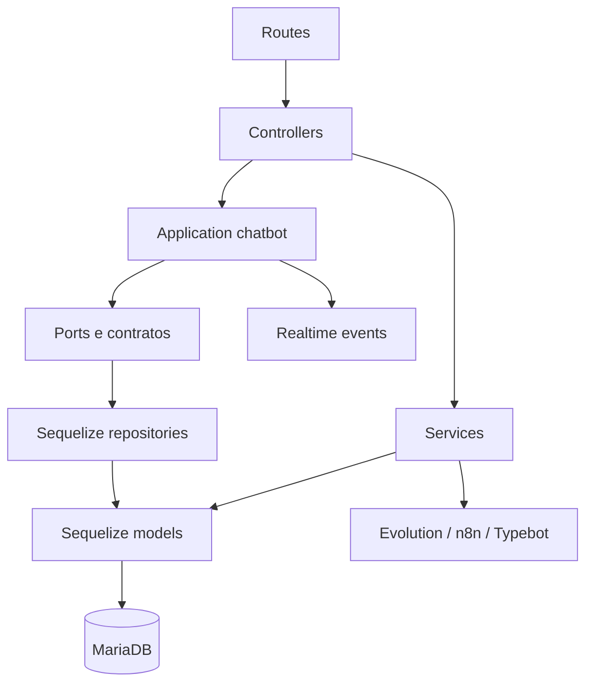
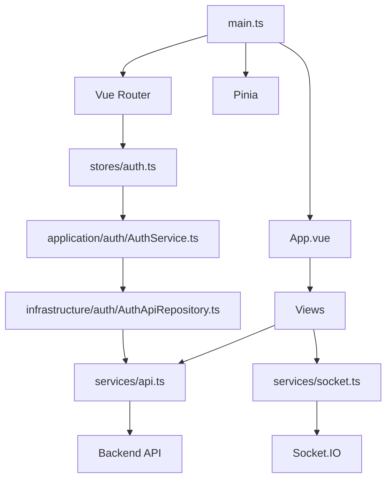

# Arquitetura

## Visao geral

## Camadas do backend

### Rotas

Arquivo: `backend/src/routes/index.ts`

Responsabilidades:

- separar rotas publicas e protegidas
- aplicar `authMiddleware`, `roleMiddleware` e `webhookAuthMiddleware`
- encaminhar chamadas para controllers

### Controllers

Pasta: `backend/src/controllers/`

Responsabilidades:

- ler `req.params`, `req.query`, `req.body` e usuario autenticado
- validar dados basicos
- chamar service/application
- transformar erro em resposta HTTP

### Services

Pasta: `backend/src/services/`

Responsabilidades:

- regras de negocio gerais
- integracoes externas
- bootstrap da aplicacao
- compatibilidade com Evolution API

### Application chatbot

Pasta: `backend/src/application/chatbot/`

Essa camada organiza o dominio de mensagens e conversa.

Principais arquivos:

- `chatbot-orchestrator.service.ts`: processa inbound vindo do webhook.
- `conversation-message.application.ts`: lista mensagens e envia mensagem outbound.
- `inbound-message.parser.ts`: normaliza payload da Evolution.
- `contracts.ts`: tipos do fluxo de despacho.
- `persistence/repositories.ts`: portas de persistencia.
- `providers/message-provider.port.ts`: porta de envio de mensagem.
- `strategies/typebot-dispatcher.strategy.ts`: despacho Typebot.
- `strategies/n8n-dispatcher.strategy.ts`: fallback n8n.

### Infrastructure

Pasta: `backend/src/infrastructure/`

Contem implementacoes concretas das portas, hoje usando Sequelize.

## Frontend

### Views principais

| Rota | View | Perfis |
|---|---|---|
| `/login` | `Login.vue` | publico |
| `/` | `Dashboard.vue` | admin, manager |
| `/tickets` | `Tickets.vue` | admin, manager |
| `/operator/queue` | `OperatorQueue.vue` | agent, viewer |
| `/instances` | `Instances.vue` | admin, manager |
| `/settings` | `Settings.vue` | admin, manager |
| `/builder` | `TypebotBuilder.vue` | admin, manager |
| `/admin/users` | `AdminUsers.vue` | admin, manager |

## Banco de dados

Models principais:

- `Company`
- `User`
- `Instance`
- `Ticket`
- `Message`
- `Flow`
- `FlowWorkspace`
- `MessageTemplate`
- `BotConfig`

As associacoes estao centralizadas em `backend/src/models/index.ts`.

## Realtime

Eventos emitidos pelo backend:

- `server:ticket.created`
- `server:ticket.updated`
- `server:message.created`
- `server:welcome`
- `server:pong`

Salas:

- `company:{companyId}`
- `user:{userId}`
- `ticket:{ticketId}`

O frontend conecta automaticamente apos login ou carregamento do usuario autenticado.

## Deploy

O caminho recomendado para deploy simples esta em:

- `docker-compose.simple.yml`
- `.env.simple.example`
- `DEPLOY_SIMPLES.md`
- `.github/workflows/cd.yml`

O compose simples usa:

- frontend
- backend
- mariadb
- evolution
- postgres

Ele evita Traefik, GHCR, Slack, Redis, Typebot e n8n para reduzir pontos de falha.
