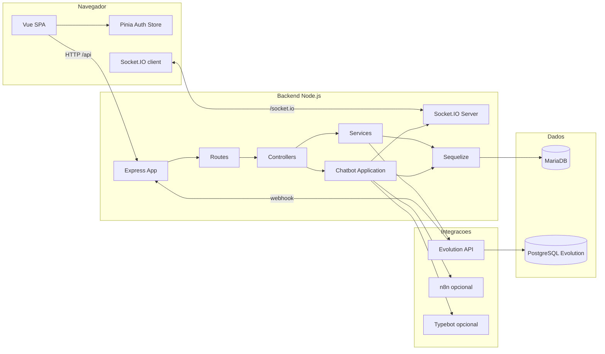
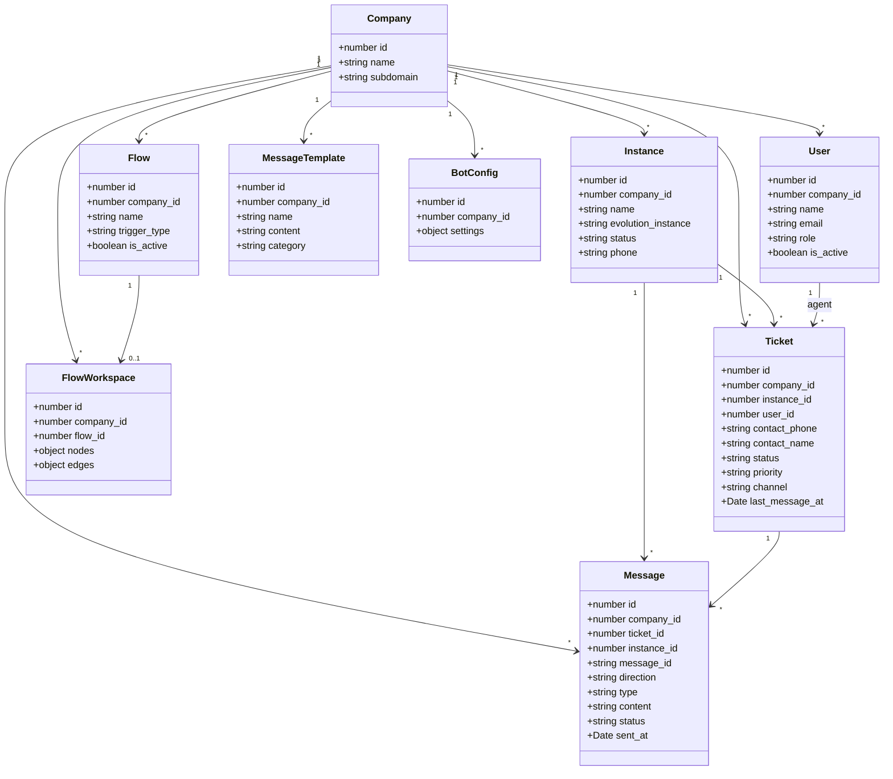
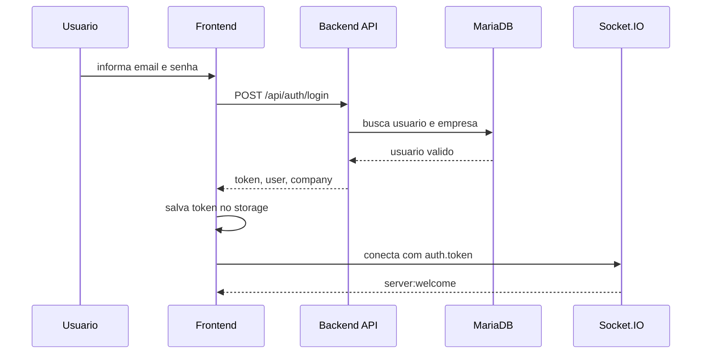
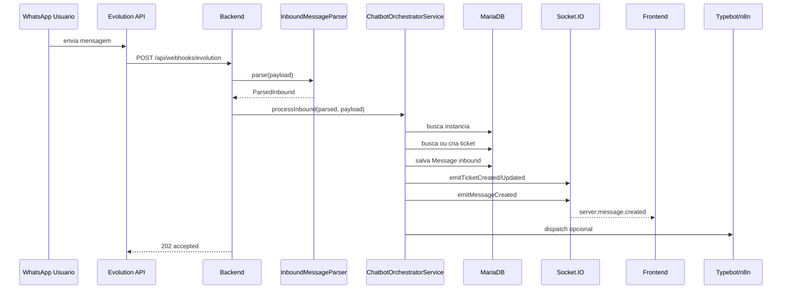
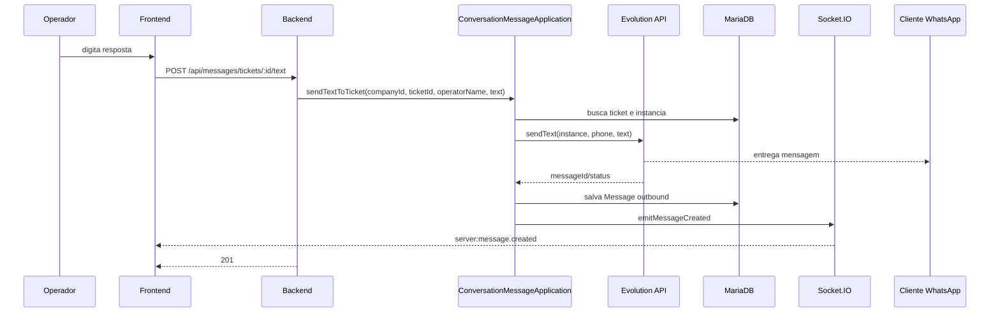
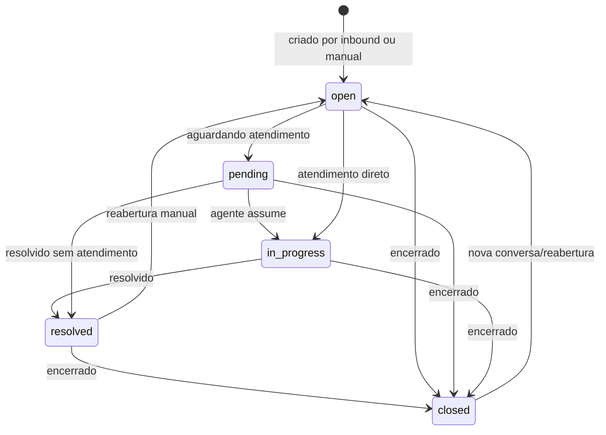
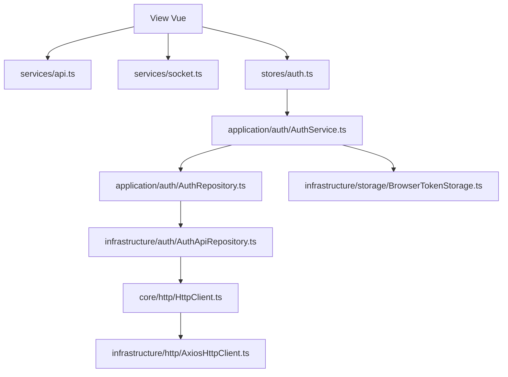

# UML e diagramas

Os diagramas abaixo usam Mermaid. Eles renderizam no GitHub e em extensoes comuns do VS Code.

Versoes vetoriais em SVG para importar em Figma, Illustrator, Inkscape ou diagrams.net estao em [docs/vetores](./vetores/README.md).

## Componentes

## Classes do dominio de dados

## Classes do fluxo chatbot

```mermaid
classDiagram
  class WebhookController {
    -InboundMessageParser parser
    -ChatbotOrchestratorService chatbotOrchestrator
    +evolutionInbound(req, res)
  }

  class InboundMessageParser {
    +parse(body) ParsedInbound
  }

  class ChatbotOrchestratorService {
    -findOrCreateTicket(instance, parsed, tx)
    -persistInboundMessage(instance, ticket, parsed, rawPayload, tx)
    +processInbound(parsed, rawPayload)
  }

  class ConversationMessageApplication {
    +listTicketMessages(companyId, ticketId, limit, offset)
    +sendTextToTicket(companyId, ticketId, operatorName, text)
  }

  class InstanceRepository {
    <<interface>>
    +findByEvolutionInstance(instanceName)
    +findByIdAndCompany(instanceId, companyId)
  }

  class TicketRepository {
    <<interface>>
    +findByIdAndCompany(ticketId, companyId)
    +findLatestOpenByContact(companyId, instanceId, contactPhone)
    +createInboundTicket(input)
    +touchLastMessage(ticket, contactName)
  }

  class MessageRepository {
    <<interface>>
    +listByTicket(companyId, ticketId, options)
    +createInbound(input)
    +createOutbound(input)
  }

  class FlowRepository {
    <<interface>>
    +listActiveWebhookFlows(companyId)
  }

  class UnitOfWork {
    <<interface>>
    +runInTransaction(callback)
  }

  class MessageProviderPort {
    <<interface>>
    +sendText(input)
  }

  class TypebotDispatcherStrategy {
    +canHandle(flow)
    +dispatch(context)
  }

  class N8nDispatcherStrategy {
    +canHandle(flow)
    +dispatch(context)
  }

  WebhookController --> InboundMessageParser
  WebhookController --> ChatbotOrchestratorService
  ChatbotOrchestratorService --> InstanceRepository
  ChatbotOrchestratorService --> TicketRepository
  ChatbotOrchestratorService --> MessageRepository
  ChatbotOrchestratorService --> FlowRepository
  ChatbotOrchestratorService --> UnitOfWork
  ChatbotOrchestratorService --> TypebotDispatcherStrategy
  ChatbotOrchestratorService --> N8nDispatcherStrategy
  ConversationMessageApplication --> MessageProviderPort
  ConversationMessageApplication --> TicketRepository
  ConversationMessageApplication --> InstanceRepository
  ConversationMessageApplication --> MessageRepository
  ConversationMessageApplication --> UnitOfWork
```

## Sequencia: login

## Sequencia: mensagem inbound do WhatsApp

## Sequencia: resposta do operador

## Estado do ticket

## Fluxo de dependencias do frontend

