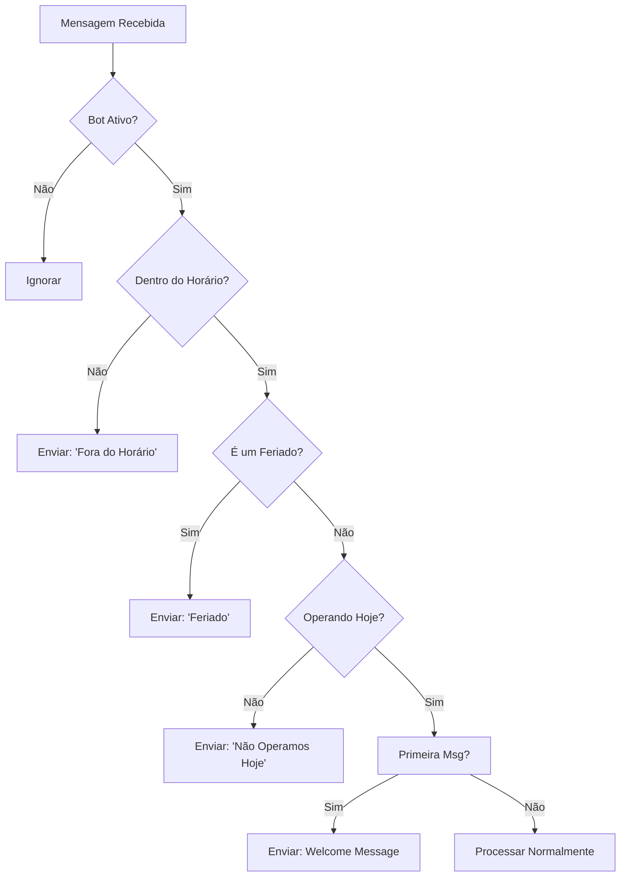

# Configurações de Funcionamento do Bot

## Visão Geral

O módulo de **Configurações de Funcionamento do Bot** permite que administradores configurem:

- **Horários de Atendimento**: Define quando o bot está disponível
- **Dias de Operação**: Seleciona em quais dias da semana o bot funciona
- **Feriados**: Marca datas específicas quando o bot não responde
- **Mensagens de Boas-vindas**: Customiza a primeira mensagem enviada
- **Mensagens Padrão**: Define respostas automáticas para diferentes situações

## Arquitetura

### Backend

#### Model: `BotConfig`
- **Localização**: `/backend/src/models/BotConfig.ts`
- **Campos principais**:
  - `company_id` - Empresa proprietária (obrigatório)
  - `instance_id` - Instância específica (opcional, se nulo = padrão da empresa)
  - `opening_hour` - Hora de abertura (HH:mm)
  - `closing_hour` - Hora de fechamento (HH:mm)
  - `operating_days` - Array com dias da semana [0-6]
  - `holidays` - Object com feriados {data: nome}
  - `welcome_message` - Mensagem de boas-vindas
  - `standard_messages` - Object com mensagens padrão
  - `active` - Flag de ativação

#### Service: `BotConfigService`
- **Localização**: `/backend/src/services/bot-config.service.ts`
- **Métodos principais**:
  - `upsertBotConfig()` - Criar/atualizar configuração
  - `getBotConfigByCompany()` - Obter config da empresa/instância
  - `isWithinBusinessHours()` - Verificar se está no horário
  - `getWelcomeMessage()` - Obter mensagem de boas-vindas
  - `getStandardMessages()` - Obter mensagens padrão
  - `deleteBotConfig()` - Deletar configuração

#### Controller: `BotConfigController`
- **Localização**: `/backend/src/controllers/bot-config.controller.ts`
- **Endpoints**:
  - `POST /bot-config` - Criar/atualizar (admin/manager)
  - `GET /bot-config` - Obter config (todos authentificados)
  - `GET /bot-config/all` - Listar todas (admin/manager)
  - `GET /bot-config/:id` - Obter por ID (admin/manager)
  - `GET /bot-config/check/hours` - Verificar horário (público)
  - `GET /bot-config/messages/welcome` - Obter msg boas-vindas
  - `GET /bot-config/messages/standard` - Obter msgs padrão
  - `DELETE /bot-config/:id` - Deletar (admin)

### Frontend

#### View: `BotSettings.vue`
- **Localização**: `/frontend/src/views/BotSettings.vue`
- **Rota**: `/bot-settings`
- **Funcionalidades**:
  - Editor de horários de atendimento
  - Seletor visual de dias da semana
  - Gerenciador de feriados
  - Editor de mensagens
  - Validação em tempo real
  - Feedback visual com toast notifications

## Como Usar

### Para Administradores

1. **Acessar a Tela**:
   - Navegue até `/bot-settings`
   - A tela está disponível para admin e manager

2. **Configurar Horários**:
   - Selecione hora de abertura e fechamento
   - O resumo mostra automaticamente o intervalo

3. **Selecionar Dias**:
   - Clique nos botões dos dias para ativar/desativar
   - Dias em verde = operacional
   - Um resumo mostra os dias selecionados

4. **Adicionar Feriados**:
   - Digite a data e o nome do feriado
   - Clique em "+ Adicionar Feriado"
   - Para remover, clique em "Remover"

5. **Customizar Mensagens**:
   - **Boas-vindas**: Primeira mensagem enviada
   - **Padrão**: Respostas automáticas
     - Saudação
     - Despedida
     - Ajuda
     - Mensagem fora do horário
     - Mensagem de feriado

6. **Salvar**:
   - Clique em "Salvar Configurações"
   - Uma notificação confirma o sucesso

### Para Integradores

#### Verificar se Bot está Aberto

```typescript
// Frontend
const response = await api.get('/bot-config/check/hours', {
  params: {
    instance_id: 123 // opcional
  }
});
console.log(response.data.is_open); // true/false
```

#### Obter Mensagem de Boas-vindas

```typescript
const response = await api.get('/bot-config/messages/welcome', {
  params: {
    instance_id: 123 // opcional
  }
});
console.log(response.data.welcome_message);
```

#### Obter Mensagens Padrão

```typescript
const response = await api.get('/bot-config/messages/standard', {
  params: {
    instance_id: 123 // opcional
  }
});
console.log(response.data);
// Retorna: { greeting, goodbye, help, outside_hours, holiday }
```

## Estrutura de Dados

### Exemplo de BotConfig

```json
{
  "id": 1,
  "company_id": 1,
  "instance_id": null,
  "opening_hour": "09:00",
  "closing_hour": "18:00",
  "operating_days": [1, 2, 3, 4, 5],
  "holidays": {
    "2024-12-25": "Natal",
    "2024-01-01": "Ano Novo"
  },
  "welcome_message": "Olá! Bem-vindo ao nosso atendimento. Como posso ajudar?",
  "standard_messages": {
    "greeting": "Olá",
    "goodbye": "Até logo",
    "help": "Como posso ajudar?",
    "outside_hours": "Desculpe, estamos fora do horário de atendimento",
    "holiday": "Desculpe, estamos fechados por feriado"
  },
  "active": true,
  "created_at": "2024-04-13T10:30:00Z",
  "updated_at": "2024-04-13T10:30:00Z"
}
```

## Fluxo de Negócio



## Validações

- **Horários**: Formato HH:mm validado com regex
- **Abertura < Fechamento**: Horário de abertura deve ser anterior ao de fechamento
- **Dias**: Array não vazio obrigatório
- **Mensagens**: 
  - Obrigatório preenchimento
  - Máximo 1000 caracteres (boas-vindas)
  - Máximo 500 caracteres (padrão)

## Permissões

- **Criar/Editar**: admin, manager
- **Visualizar**: admin, manager, agent, viewer
- **Deletar**: admin
- **Verificar Horário**: Público (sem autenticação)
- **Obter Mensagens**: Todos authentificados

## Migração do Banco

Execute o arquivo SQL:

```bash
mysql -u user -p database < infrastructure/migrations/001_create_bot_configs.sql
```

Ou use sua ferramenta de migração preferida.

## Exemplos de Uso

### Adicionar Feriados Brasileiros

```typescript
const config = {
  opening_hour: '09:00',
  closing_hour: '18:00',
  operating_days: [1, 2, 3, 4, 5],
  holidays: {
    '2024-01-01': 'Ano Novo',
    '2024-03-29': 'Sexta-feira Santa',
    '2024-04-21': 'Tiradentes',
    '2024-05-01': 'Dia do Trabalho',
    '2024-09-07': 'Independência',
    '2024-10-12': 'Nossa Senhora Aparecida',
    '2024-11-02': 'Finados',
    '2024-11-20': 'Consciência Negra',
    '2024-12-25': 'Natal'
  },
  welcome_message: 'Olá! Bem-vindo ao atendimento. Como posso ajudar?',
  standard_messages: {
    greeting: 'Olá',
    goodbye: 'Até logo',
    help: 'Como posso ajudar?',
    outside_hours: 'Estamos fora do horário de atendimento. Retornaremos logo!',
    holiday: 'Estamos fechados. Feliz feriado!'
  }
};

await api.post('/bot-config', config);
```

## Troubleshooting

### Mensagens não aparecem
1. Verifique se o bot está ativo
2. Confirme se está dentro do horário configurado
3. Valide se o dia está selecionado

### Feriados não funcionam
1. Verifique o formato da data (YYYY-MM-DD)
2. Confirme o timezone do servidor

### Endpoints retornam 404
1. Verifique se o modelo BotConfig foi criado na tabela
2. Execute a migração SQL
3. Valide as permissões do usuário
